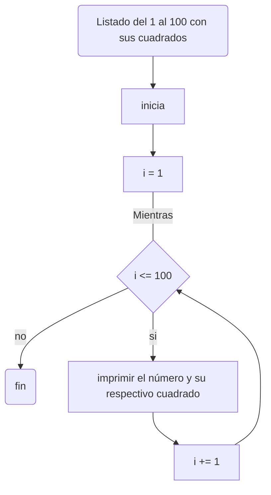
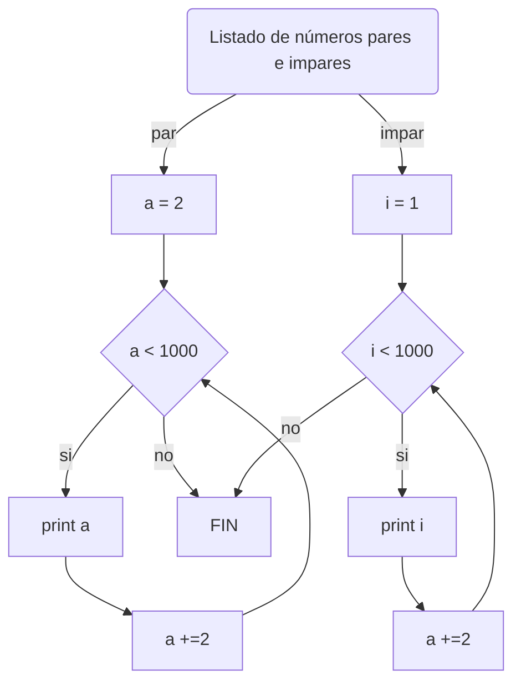

# Reto #7 Bucles 1
Espero que se encuentren excelente estimados lectores, en el presente repositorio haremos varios ejemplos de código en Python utilizando lo aprendido acerca de los bucles dentro de nuestra clase de programación de computadores

## Ejemplo No. 1
Se debe imprimir un listado de números del 1 al 100 con su respectivo cuadrado.
1. Se incializa las variables que intervienen en el bucle, en este caso el número 1.
```sh
i = 1 
```
2. Se determina la condición que se va a evaluar, que este problema es todos los números naturales menores a 100
```sh
while i <= 100:
```
3. Se solicita que se impriman aquellos números entee 1 y 100 y sus respectivos cuadrados.
```sh
print("El cuadrado del número "+str(i)+", es "+str(i**2)+"")
```
4. Se actualizan las varables, para que el código funcione de una manera óptima.
```sh
i += 1
```
A continuación el pseudocódigo correspondiente al problema anterior:
```sh
i = 1 
while i <= 100:
    print("El cuadrado del número "+str(i)+", es "+str(i**2)+"")
    i += 1
```
El programa funciona de  la siguiente manera, ejecutandolo dentro de un notebook de python.


El diagrama de flujo correspondiente al ejemplo número 1 es el presentado a continuación:


## Ejemplo No. 2
Ahora bien se debe imprimir en python un listado de números impares dentro del intervalo de 1 y 999, al lado de aquel listado se debe imprimir un listado de números pares dentro del rango de 2 a 100.
1. Se inicializa tanto el listado par, el cual empieza en 1, como el impar, que inicia en 2.
```sh
i = 1
a = 2
```
2. A continuación se indica el condicional que tendrán las variables, es decir que sean menores a mil.
```sh
while i < 1000:
while a < 1000:
```
3. Se imprimen ambas variables
```sh
print(i)
print(a)
```
4. Se actualiza en ambas listas, en este ejemplo se debe sumar de dos en dos, ya que así se encuentran los número pares e impares en la recta numérica
```sh
i +=2
a +=2
```
El código solución para dicho problema es el siguiente:
```sh
i = 1
while i < 1000:
  print(i)
  i +=2

a = 2
while a < 1000:
  print(a)
  a +=2
```
Al ejecutar el programa diseñado se puede ver de la posterior manera:


Dado que el programa está configurado para imprimir solo 30 resultados, se muestra como inicia la lista de carácteres impar y como termina la lista par.
A continuación el digrama de flujo representativo del ejemplo número 2:


## Ejemplo No. 3
El ejemplo consiste en diseñar un programa que imprima los números pares de forma descendente iniciando de un número natural ingresado por el usuario.
1. Se solicita al usuario que ingrese un número natural.
```sh
i = int(input("Ingrese un numero natural: "))
```
2. Se indica el condicional que imprime todos los números mayores a 2
```sh
while i >= 2:
```
3. A continuación se realiza el condicional para número par y se imprime "i" si es el caso
```sh
 if i%2 == 0:
     print(i)
```
4. Actualizamos restándole 2 a cada número de la lista
```sh
i -= 2
```
5. Ahora se realiza el condicional else en caso que el número ingresado por el usuario no sea par, imprimiendo dicho número menos 1, para que el resultado sea un número par
```sh
 else:
     print (i-1)
```
6. Actualizamos restándole 2 a cada número de la lista
```sh
i -= 2
```
El código que resuelve el ejemplo es:
```sh
i = int(input("Ingrese un numero natural: "))
while i >= 2:
 if i%2 == 0:
     print(i)
     i -= 2
 else:
     print (i-1)
     i -= 2
```
Así funciona el programa ingresando un número par como el 12:


Y así funciona el programa ingresando un número impar como el 17:


El diagrama correspondiente es el siguiente:

## Ejemplo No. 4
En el año 2022 el país A tendrá una población de 25 millones de habitantes y el país B de 18:9 millones. Las tasas de crecimiento anual de la población serán de 2% y 3% respectivamente. Desarrollar un algoritmo para informar en que año la población del país B superará a la de A.
1. Se declaran las variables, es decir la población de los países y el año en el que dichos países tienen esa cantidad de población.
```sh
A = 25
B = 18.9
t = 2022
```
2. Indicamos el condicional
```sh
while A >= B:
```
3. Actualizamos cada variable, la de la cantidad de habitantes multiplicandola con sus tasa de crecimiente y la del año sumandole 1
```sh
A += A* 0.02
B += B * 0.03
t += 1
```
4. Imprimimos el año en el que la población B supera a la A.
```sh
print("La población del país B superará a la de A en el año "+str(t)+"")
```
La solución que nos permitirá saber en que año la población del país B superara a la del país A es la siguiente:
```sh
A = 25
B = 18.9
t = 2022
while A >= B:
      A += A* 0.02
      B += B * 0.03
      t += 1
print("La población del país B superará a la de A en el año "+str(t)+"")
```
El programa funcionando se ve así:


## Ejemplo No. 5
Se debe imprimir el número factorial de un número ingresado.
1. El programa debe solicitar al usuario ingresar un número natural
```sh
a = int(input("Ingrese un numero natural: "))
```
2. Se declaran dos variables adicionales, las cuales serán inicializadas en 1.
```sh
n = 1
i = 1
```
3. Colocamos el condicional, el cual hace que se ejecute mientras el valor de "n" no supere al de "i"
```sh
while i <= a:
```
4. Se actualizan las variabes inicializadas en 1, una sumandole uno y la otra multiplicandola, siempre y cuando se cumpla la condición
```sh
 n *= i
 i += 1
```
5. Imprimimos el resultado, el cual es el número factorial de la cifra ingresada por el usuario
```sh
print("El número factorial del número "+str(a)+" es "+str(n)+"")
```
La solución digitada en pseudocódigo es la siguiente:
```sh
a = int(input("Ingrese un numero natural: "))
n = 1
i = 1
while i <= a:
 n *= i
 i += 1
print("El número factorial del número "+str(a)+" es "+str(n)+"")
```
Al ejecutar el programa corre así:


## Ejemplo No. 6
Diseñar un programa que adivine un número de 1 a 100, preguntando si es mayor o menor.
1. Solicitar al usuario el ingreso del número que se quiera adivinar
```sh
n= int(input("Ingresa el número a adivinar (1-100): "))
```
2. Inicializar la variables
```sh
a = False
```
3. Colocar el condicional
```sh
while not a
```
4. Solicitar al usuario que adivine el número ingresado por el otro usuario
```sh
t = int(input("Adivina el número (1-100): "))
```
5. Imprimir según sea el caso, ya sea  que la cifra ingresada sea mayor, menor o igual a la ingresada primeramente
```sh
    if t < n:
        print("El número es mayor")
    elif t > n:
        print("El número es menor")
    else:
        print("¡Adivinaste el número!")
```
6. Actalizar la variable
```sh
a = True
```
El código completo:
```sh
n= int(input("Ingresa el número a adivinar (1-100): "))
a = False
while not a:
    t = int(input("Adivina el número (1-100): "))
    if t < n:
        print("El número es mayor")
    elif t > n:
        print("El número es menor")
    else:
        print("¡Adivinaste el número!")
        a = True
```
El programa funcionando


## Ejemplo No. 7
Diseñar un programa que al ingresar un número del 1 al 50 muestre sus divisores
1. Solicitar el ingreso de un número natural que se encuentre dentro del rango de 2 y 50.
```sh
n = int(input("Ingresa un número entre 2 y 50: "))
```
2. Se inicializa la variables de los divisores
```sh
i = 1
```
3. Se realiza el condicional, el cual determina que se realice el bucle mientras los divisores sean menores o iguales al número ingresado
```sh
while i <= n:
```
4. Si el residuo del número ingreso entre el divisor es igual a cero imprimir el resultado.
```sh
if n%i == 0:
    print (i)
```
5. Actualizar la variable
```sh
i += 1
```
El pseudocódigo completo se ve de la siguiente manera:
```sh
n = int(input("Ingresa un número natural entre 2 y 50: "))
i = 1
while i <= n:
  if n%i == 0:
    print (i)
  i += 1
```
El programa funciona de la siguiente manera:


## Ejemplo No. 8
Mediante el uso de funciones se debe realizar un código que imprima los números primos entre 1 y 100
1. Definir la función
```sh
def es_primo(n)
```
2. Realizar el condicional, si son menores a dos retornar la variable booleana falsa
```sh
if n < 2:
  return False
```
3. Inicializar el bucle y utilizar la palabra resevada while
```sh
i = 2
  while i < n:
```
4. A partir de dicha inicialización realizar otro condicional para determinar si el número tiene más divisores a parte de el mismo y el 1
```sh
if n % i == 0:
  return False
```
5. Actualizar
```sh
i = i + 1
  return True
```
6. Imprimir los valores de "n"
```sh
print("Los números primos del 1 al 100 son:")
```
7. Utilizar la función definida anteriormente
```sh
n= 1
while n <= 100:
    if es_primo(n):
        print(n)
    n =n + 1
```
Código solución a dicho problema
```sh
def es_primo(n):
    if n < 2:
        return False
    i = 2
    while i < n:
        if n % i == 0:
            return False
        i = i + 1
    return True

print("Los números primos del 1 al 100 son:")
n= 1
while n <= 100:
    if es_primo(n):
        print(n)
    n =n + 1
```
Al ejecutarse el programa corre así:


## FIN
Hasta acá llega nuestro camino en el presente repo, espero que haya sido de tu interés, si encuentras algún error o alguna inconsistencia, no dudes en contactarme y hacermela saber.
Muchas Gracias por tu atención.

   **"Llega un momento en el que dejas de esperar, dejas de escribir, dejas de buscar y comienzas a vivir sin depender"**
         - Anónimo
